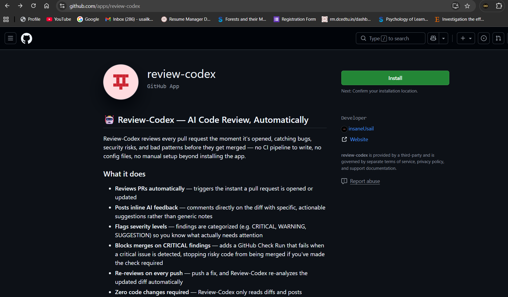
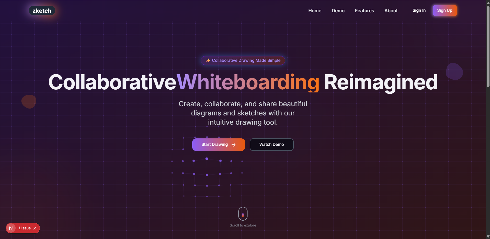
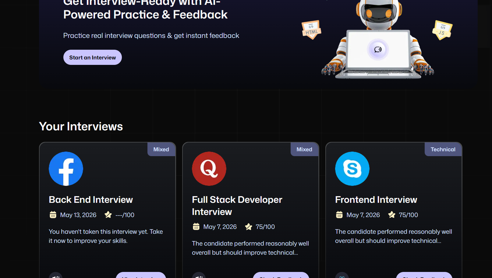
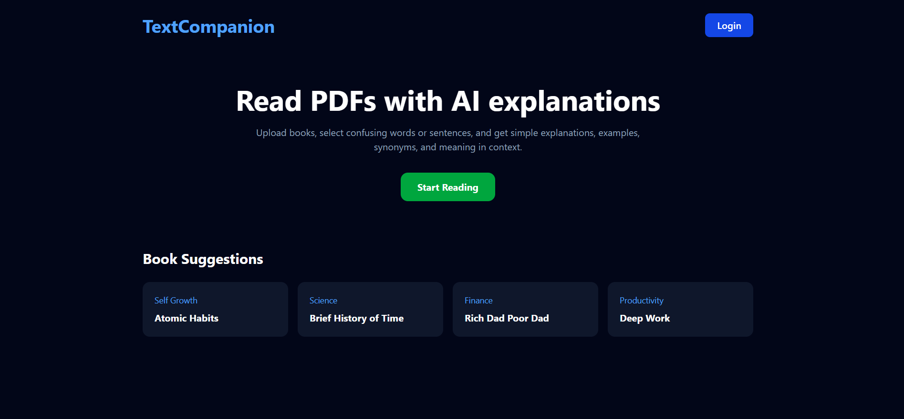

 

## About Me

<table>
<tr>
<!-- Image Column -->
<td width="260" valign="top" align="center">
  
</td>

<!-- Text Column with Custom Background Color -->
<td valign="top" bgcolor="#161b22" style="padding: 20px; border-radius: 10px;">

### Hi there! 👋

I'm usually the same person writing the UI, the backend, the auth, and the deploy config. My repos lean toward two problems: **real-time sync** (chat, collaborative canvases) and **wiring LLMs into real features** (code review, data analysis, interview prep) rather than another chatbot wrapper.

Lately I've been focused on infrastructure — job queues, webhook security, rate limiting, WebSocket protocols — the parts that decide whether a project survives real traffic, not just the demo.

**Habits that show up across my repos:**
- 🛡️ **Verify inputs at the boundary** — webhook signatures, JWTs, Zod schemas
- ⛓️ **Fallback chains over failure** — prefer a degraded response over a broken one
- 🛠️ **Pragmatic tooling** — reach for managed tools first, drop to raw primitives for control

</td>
</tr>
</table>

## Tech Stack

## Tech Stack

  

| | |
|---|---|
| **Languages** | JavaScript · TypeScript · Python · C++ |
| **Frontend** | React · Next.js · Redux · Zustand · Tailwind · Vite · Radix UI |
| **Backend** | Node.js · Express · FastAPI · Socket.IO · `ws` · BullMQ |
| **Databases** | PostgreSQL · Prisma · MongoDB · Supabase · Firebase |
| **AI & ML** | Gemini · Groq (Llama 3.x) · OpenAI SDK · Vapi · pandas/numpy |
| **DevOps** | Docker · Turborepo · Redis · PM2 · Vercel |
| **Tools** | JWT · Cloudinary · Stripe · GitHub Webhooks API · Zod |

## Featured Projects

<table>
<tr>
<td width="120" valign="top"></td>
<td valign="top">

**🔍 [Review-Codex](https://github.com/insaneUsail/Review-Codex)** — AI GitHub App that reviews every PR with an LLM and can **block merges** via a failing Check Run on critical findings.
`TypeScript` `Express` `Redis` `BullMQ` `Groq` · HMAC-verified webhooks, rate limiting, token-aware diff chunking, idempotent job fan-in.

</td>
</tr>
</table>

<table>
<tr>
<td width="120" valign="top"></td>
<td valign="top">

**🎨 [Zketch](https://github.com/insaneUsail/Zketch)** — real-time collaborative whiteboard with persistent room state that survives refreshes.
`Next.js` `ws` `Prisma` `PostgreSQL` `Turborepo` · hand-written WebSocket protocol with auth handshake, monorepo architecture.

</td>
</tr>
</table>

<table>
<tr>
<td width="120" valign="top"></td>
<td valign="top">

**🎙️ [AI-interview-WebApp](https://github.com/insaneUsail/AI-interview-WebApp)** — voice-driven mock interview platform with an LLM generating questions and a live voice agent running the interview.
`Next.js` `FastAPI` `Groq` `Vapi` `Firebase` · polyglot TS + Python backend, resilient LLM output parsing.

</td>
</tr>
</table>

<table>
<tr>
<td width="120" valign="top"></td>
<td valign="top">

**📊 [InsightAI](https://github.com/insaneUsail/InsightAI)** — upload a CSV, get automatic KPIs, charts, and a Gemini-generated executive summary.
`FastAPI` `pandas` `Gemini API` `React` · heuristic column detection, no hard-coded schema.

</td>
</tr>
</table>

<table>
<tr>
<td width="120" valign="top"></td>
<td valign="top">

**📖 [Text-Companion](https://github.com/insaneUsail/Text-Companion)** — AI reading companion; select text in a PDF, get an instant explanation.
`React` `Express` `Supabase` `Gemini` `Groq` · three-tier AI fallback chain (Gemini → Groq → offline default).

</td>
</tr>
</table>

## Engineering Highlights

- **AI integration, more than one way** — Gemini, Groq, OpenAI SDK, and a voice agent (Vapi), including a multi-provider fallback chain and structured-JSON prompting
- **Real-time at different levels** — Socket.IO, a hand-rolled WebSocket protocol, and a job queue used as async "broadcast"
- **Backend infra** — Redis rate limiting, BullMQ fan-out/fan-in, HMAC webhook verification
- **Auth, repeated deliberately** — JWT middleware in nearly every backend, plus Firebase/Supabase auth
- **Full-stack commerce** — cart, Stripe checkout, order lifecycle, role-gated admin dashboard
- **Developer tooling** — Turborepo monorepo with shared config packages, Docker, PM2

## Current Interests

- Agentic / LLM-powered developer tooling
- Lower-level real-time systems (raw WebSockets over Socket.IO)
- Voice-driven AI interfaces

## GitHub Stats

<table>
  <tr>
    <td></td>
    <td></td>
  </tr>
</table>

 

## Connect

  
  
  

